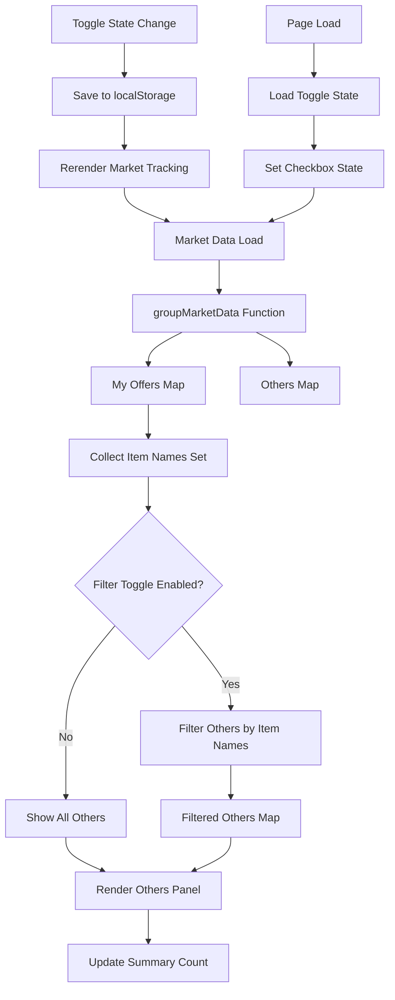

# Market Tracking Filter Implementation Flow

## System Architecture Diagram



## Data Flow Process

### 1. Initial Data Processing
```
Vending Machine Data → groupMarketData() → {
  myOffers: Map<offerKey, offerData>,
  others: Map<offerKey, offerData>
}
```

### 2. Filter Logic (when enabled)
```
myOffers → Extract itemNames → Set<string>
others → Filter by itemNames → Filtered Map<offerKey, offerData>
```

### 3. Rendering Pipeline
```
Filtered/Original Others → Generate HTML → Update DOM
```

## Component Interaction

### UI Components
- **Toggle Checkbox**: User input for filter state
- **Others Panel Header**: Contains toggle and summary
- **Others Summary**: Shows "x/y offers" when filtered
- **Others Body**: Displays filtered or all offers

### State Management
- **showOnlyMatchingItems**: Boolean flag
- **localStorage**: Persistence across sessions
- **Event Listeners**: Handle toggle changes and page load

### Integration Points
1. **renderMarketTracking()**: Main rendering function (lines 1326-1375)
2. **Others panel header**: UI modification point (lines 665-667)
3. **JavaScript variable scope**: Global state management (line 755 area)

## Filter Matching Logic

### Exact Name Matching
```javascript
// Create Set for O(1) lookup
const myOfferItemNames = new Set([
  "HQ Metal",
  "Scrap", 
  "Wood"
]);

// Filter others
filteredOthers = others.filter(offer => 
  myOfferItemNames.has(offer.itemName)
);
```

### Edge Case Handling
1. **No My Offers**: Show all others regardless of toggle
2. **No Matches**: Display "No matching items found" message
3. **Empty Others**: Handle gracefully with appropriate messaging
4. **Manual Offers**: Include in myOffers item set for filtering

## Performance Considerations

### Efficient Data Structures
- **Set for item names**: O(1) lookup complexity
- **Map for offers**: Maintains existing data structure
- **Conditional filtering**: Only process when toggle enabled

### Rendering Optimization
- **Rerender on demand**: Only when data or toggle state changes
- **Preserve original data**: Don't mutate source data
- **Minimal DOM updates**: Update only affected elements

## User Experience Flow

### Normal Operation
1. User sees all "Others" offers (default)
2. User enables "Match my offers" toggle
3. System filters and shows only matching items
4. Summary updates to show "x/y offers"
5. State persists across page refresh

### Reset Behavior
1. User disables toggle
2. All "Others" offers reappear
3. Summary shows total count only
4. State saved for next session

## Testing Scenarios Matrix

| Scenario | My Offers | Others | Toggle State | Expected Result |
|----------|-----------|--------|--------------|-----------------|
| Empty | None | 10 items | Off | Show all 10 |
| Empty | None | 10 items | On | Show all 10 |
| Partial | 3 items | 10 items | Off | Show all 10 |
| Partial | 3 items | 10 items | On | Show only matches |
| No Matches | 5 items | 3 items | On | Show "no matches" |
| Manual Only | 2 manual | 8 others | On | Filter by manual |